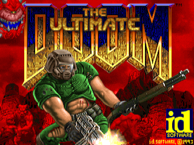

# Run DOSBox Emulator in web browser.
### Click the thumbnail to open a game.
# The Ultimate Doom

# Digger

# Wolfenstein 3D

# SimCity 2000

# SimCity Classic

# Super Mario Bros.

# Microsoft Flight Simulator
**WARNING: This game has no mobile support.**

# Windows 1.04

# Windows 2.03

# Windows 3.1

